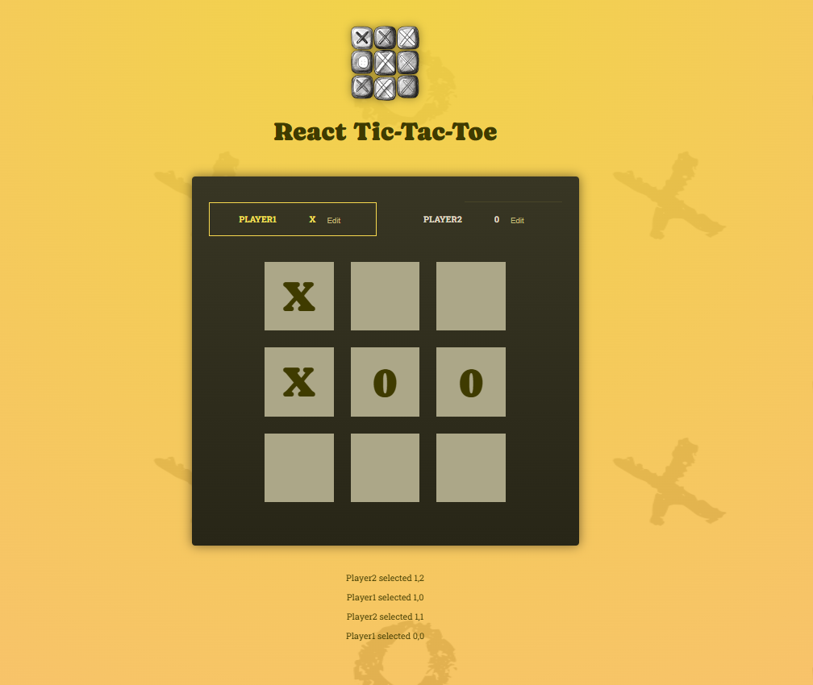

# React Tic-Tac-Toe Game

This project is a modern and interactive **Tic-Tac-Toe** game built using **React**. The UI features a stylish yellow and black theme, with a 3x3 grid where two players can compete by marking either "X" or "O". The game highlights players' moves and displays a log of the selected moves.

## Table of Contents

- [Features](#features)
- [Game Rules](#game-rules)
- [Screenshots](#screenshots)
- [How to Play](#how-to-play)
- [Installation](#installation)
- [Technologies Used](#technologies-used)
- [Contributing](#contributing)
- [License](#license)

## Features

- **Interactive Game Board**: The game provides a clear and responsive 3x3 grid for players.
- **Real-time Move Logging**: Each player's move is logged below the game board for reference.
- **Player Name Editing**: Players can edit their names directly from the game interface.
- **Reset and Start Over**: The game can be reset to start a new match at any time.
- **Winner Detection**: Automatically checks for a winning combination (three in a row) and declares the winner.
- **Stylish UI**: Designed with a modern, eye-catching yellow background and minimalist game board.

## Game Rules

1. The game is played on a 3x3 grid.
2. Player 1 is "X", and Player 2 is "O". Players take turns marking an empty square.
3. The first player to get 3 marks in a row (vertically, horizontally, or diagonally) wins the game.
4. If all 9 squares are filled without a winner, the game ends in a draw.
5. Players can reset the game at any time to start a new match.

## Screenshots



## How to Play

1. **Clone** this repository to your local machine:
   ```bash
   git clone https://github.com/Khemchand992/Game.git
2. Install dependencies:
   ```bash
   cd Game/Tic-Tac-Toe
    npm install
3. Start the development server:
   ```bash
   npm start
   ```
4.Play the game: 

    ```bash
    Open http://localhost:3000 in your browser to view the game and start playing.
    ```
Controls
Click on any empty square to place your mark ("X" or "O").
Edit player names: Click on the "Edit" button next to Player 1 or Player 2 to customize the player names.
Reset: Use the "Reset" button to clear the board and start a new game.
The log of moves will appear below the board, showing the latest selections by each player.
Installation
To run the game locally:

Clone the repository:
```bash
    git clone https://github.com/Khemchand992/Game.git
```
Navigate to the Tic-Tac-Toe directory:
```bash
cd Game/Tic-Tac-Toe
```
Install dependencies:
```bash
npm install
```
Run the app:
```bash
npm start
```
Open 
```bash
http://localhost:3000 in your browser to view the game.
```
Technologies Used
React: JavaScript library for building user interfaces.
HTML5: Markup language for structuring the web page.
CSS3: Stylesheet for the game’s design and layout.
JavaScript (ES6+): Logic for handling the game mechanics.
npm: Dependency manager for installing and managing packages.


